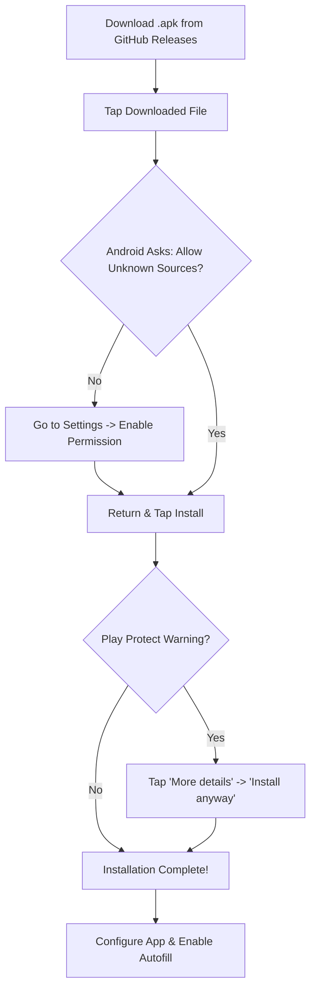
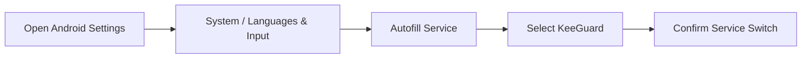

# 📘 Complete User Installation & Setup Guide

Welcome to the comprehensive installation and setup guide for products published under **[Mohd-afk/apk-releases](https://github.com/Mohd-afk/apk-releases)**. 

This guide covers step-by-step instructions for:
- 📱 Installing Android `.apk` files on mobile devices (Sideloading outside Google Play Store).
- 🧩 Installing Browser Extensions (Chrome, Brave, Edge, Opera).
- 🌐 Using Web Applications & Cloud Services (such as KeeGuard Web Vault and Admin Portal).
- 🛠️ Resolving common installation issues and troubleshooting errors.

---

## 📋 Table of Contents
1. [📱 Installing the Android APK on Mobile](#1-installing-the-android-apk-on-mobile)
   - [Step 1: Download the Latest APK](#step-1-download-the-latest-apk)
   - [Step 2: Allow Installation from Unknown Sources](#step-2-allow-installation-from-unknown-sources)
   - [Step 3: Handle Google Play Protect Prompt](#step-3-handle-google-play-protect-prompt)
   - [Step 4: Complete Installation & Grant Permissions](#step-4-complete-installation--grant-permissions)
   - [Step 5: Enabling KeeGuard Autofill Framework](#step-5-enabling-keeguard-autofill-framework)
2. [🧩 Installing the Browser Extension](#2-installing-the-browser-extension)
   - [Step 1: Obtain Extension Package](#step-1-obtain-extension-package)
   - [Step 2: Enable Browser Developer Mode](#step-2-enable-browser-developer-mode)
   - [Step 3: Load Unpacked Extension](#step-3-load-unpacked-extension)
   - [Step 4: Pin & Configure Extension](#step-4-pin--configure-extension)
3. [🌐 Using the Web Applications](#3-using-the-web-applications)
   - [Accessing the Vault Web App](#accessing-the-vault-web-app)
   - [Zero-Knowledge Master Password Setup](#zero-knowledge-master-password-setup)
   - [Syncing Across Mobile & Desktop](#syncing-across-mobile--desktop)
4. [🛠️ Troubleshooting & FAQ](#4-troubleshooting--faq)

---

## 📱 1. Installing the Android APK on Mobile

Since our apps (such as **KeeGuard**) are distributed directly via GitHub Releases and not hosted on the Google Play Store, they must be **sideloaded** on your Android smartphone.

### 🔄 Installation Workflow Overview



---

### Step 1: Download the Latest APK
1. Open your smartphone browser (Chrome, Brave, Firefox, or Samsung Internet).
2. Navigate to the official releases page:  
   👉 **[https://github.com/Mohd-afk/apk-releases/releases](https://github.com/Mohd-afk/apk-releases/releases)**
3. Locate the application release you wish to install (e.g., **`KeeGuard v5.0.3`**).
4. Under **Assets**, tap on the file named `app-debug.apk` or `Keeguard_5.0.3_release.apk`.
5. Your browser will prompt: *"File might be harmful. Do you want to download app-debug.apk anyway?"*
6. Tap **Download anyway**.

> [!NOTE]
> Android displays this standard warning for any file downloaded outside the Google Play Store. All our build files are scanned and open-source.

---

### Step 2: Allow Installation from Unknown Sources

When opening the downloaded `.apk` file for the first time, Android will block the installation until permission is granted to your browser or file manager.

```
┌─────────────────────────────────────────────────────────────┐
│ 🛡️ Chrome                                                   │
│                                                             │
│ For your security, your phone is currently not allowed      │
│ to install unknown apps from this source.                   │
│                                                             │
│                        [ CANCEL ]   [ SETTINGS ] ◄──────────┼── Tap SETTINGS
└─────────────────────────────────────────────────────────────┘
```

1. Tap **Settings** when the prompt appears.
2. Toggle **ON** the switch labeled **"Allow from this source"**.
3. Tap the **Back** arrow at the top-left to return to the installation screen.

#### Manually Enabling Permission (Android 8.0 to Android 15+):
If you miss the popup, you can enable it manually:
1. Open your phone's **Settings**.
2. Go to **Apps** (or **Apps & Notifications**) ➔ **Special App Access** ➔ **Install Unknown Apps**.
3. Select the browser or File Manager app you used to download the file (e.g., **Chrome** or **Files by Google**).
4. Toggle **Allow from this source** to **ON**.

---

### Step 3: Handle Google Play Protect Prompt

Android Google Play Protect may display a warning dialog for newly uploaded or non-Play Store APKs:

```
┌─────────────────────────────────────────────────────────────┐
│ ⚠️ Blocked by Play Protect                                  │
│                                                             │
│ Play Protect doesn't recognize this app's developer.        │
│ Apps from unknown developers can sometimes be unsafe.       │
│                                                             │
│ 🔽 More details  ◄──────────────────────────────────────────┼── Tap 'More details'
│                                                             │
│                                           [ GOT IT ]        │
└─────────────────────────────────────────────────────────────┘
```

1. Tap **More details** (or the down arrow) at the bottom of the prompt.
2. Tap **Install anyway** (or **Install anyway (unsafe)**).
3. Android Package Installer will proceed with installing the app.

> [!IMPORTANT]
> The "Unrecognized Developer" warning occurs because the APK signature is self-signed for direct distribution. It does NOT mean the file contains malware.

---

### Step 4: Complete Installation & Grant Permissions

1. The installer will show: **"App installed."**
2. Tap **Open** to launch **KeeGuard** (or your installed app).
3. If requested, allow necessary system permissions (e.g., Biometrics, Storage access).

---

### Step 5: Enabling KeeGuard Autofill Framework

To use KeeGuard to automatically fill credentials in apps and websites on your phone:



1. Open Android **Settings** on your device.
2. Scroll to **System** (or **General Management** depending on manufacturer like Samsung/Xiaomi).
3. Select **Languages & Input** (or **Passwords & Accounts** / **Autofill Service**).
4. Tap **Autofill service**.
5. Select **KeeGuard** from the list.
6. Tap **OK** on the system confirmation prompt.
7. Now when you tap on login input fields in Chrome or native apps, KeeGuard Autofill popups will automatically appear!

---

## 🧩 2. Installing the Browser Extension

Our browser extensions (e.g. **KeeGuard Extension** and **Smart Food Deal Extension**) bring background automation and quick access directly to your desktop browser.

### Supported Browsers
- Google Chrome
- Brave Browser
- Microsoft Edge
- Opera / Vivaldi / Arc Browser

---

### Step 1: Obtain Extension Package
1. Clone or download the extension folder from the respective repository (e.g., [`Mohd-afk/foodextension`](https://github.com/Mohd-afk/foodextension) or [`Mohd-afk/securevault-app`](https://github.com/Mohd-afk/securevault-app)).
2. If downloaded as a `.zip` archive, extract the zip file to a permanent folder on your computer (e.g., `C:\Extensions\KeeGuard`).

---

### Step 2: Enable Browser Developer Mode

1. Open your browser and navigate to the Extensions page:
   - **Chrome / Brave:** Type `chrome://extensions` in the URL address bar and press Enter.
   - **Microsoft Edge:** Type `edge://extensions` in the URL address bar and press Enter.
2. In the top-right corner of the Extensions page, locate and enable the **Developer mode** toggle switch.

```
┌─────────────────────────────────────────────────────────────────────────┐
│ 🧩 Extensions                          Search extensions [     ]  🔴 OFF│
│                                                                     ▲   │
│                                                     Toggle ON ──────┘   │
└─────────────────────────────────────────────────────────────────────────┘
```

---

### Step 3: Load Unpacked Extension

1. Once Developer mode is enabled, three new buttons will appear at the top-left:
   - **Load unpacked**
   - **Pack extension**
   - **Update**
2. Click **Load unpacked**.
3. In the file picker dialog, navigate to and select the extracted extension folder (the directory containing `manifest.json`).
4. Click **Select Folder**.

```
┌─────────────────────────────────────────────────────────────────────────┐
│  [ 📥 Load unpacked ]  [ 📦 Pack extension ]  [ 🔄 Update ]             │
│        ▲                                                                │
│  Click here and select your extension folder                            │
└─────────────────────────────────────────────────────────────────────────┘
```

---

### Step 4: Pin & Configure Extension

1. Click the **Puzzle Piece** icon (🧩 Extensions menu) in your browser toolbar.
2. Locate the installed extension (e.g., **KeeGuard Password Manager** or **Smart Food Deal Extension**).
3. Click the **Pin** icon next to it so it stays visible on your toolbar.
4. Click the extension icon to launch the popup panel and log in or configure settings.

---

## 🌐 3. Using the Web Applications

### Accessing the Vault Web App
You can access the KeeGuard Web Vault and Admin Dashboard directly through your web browser without installing any software.

- **Web Vault Portal:** Log into your personal zero-knowledge encrypted vault.
- **Admin Dashboard:** Access administrative features, user management, and configuration settings (web platform guarded).

### Zero-Knowledge Master Password Setup
1. On your first visit, create your account and set a strong **Master Password**.
2. **Crucial:** Your Master Password is used locally in your browser to derive your AES-256 encryption key. 
3. *Neither our servers nor anyone else ever sees or stores your unencrypted vault data or Master Password.*

### Syncing Across Mobile & Desktop
Because all client applications (Android APK, Browser Extension, and Web App) connect securely to your sync server, any password or custom autofill profile added on one device instantly becomes available across all your connected devices.

---

## 🛠️ 4. Troubleshooting & FAQ

### Q1: Android says "Parse Error: There was a problem parsing the package."
- **Cause:** The downloaded `.apk` file was incomplete/corrupted during download OR your Android OS version is below the minimum required version (Android 8.0 Oreo).
- **Solution:** Delete the downloaded APK file, clear browser downloads cache, and re-download `app-debug.apk` directly from [GitHub Releases](https://github.com/Mohd-afk/apk-releases/releases).

### Q2: Android says "App Not Installed."
- **Cause:** An older or conflicting version of the app with a different signature is already installed on your device.
- **Solution:** Uninstall the existing app from your smartphone home screen / Settings ➔ Apps, then run the new `.apk` installation again.

### Q3: Play Protect blocks installation continuously.
- **Solution:** Make sure to tap **More details** and then select **Install anyway**. Alternatively, temporarily disable Play Protect real-time scanning in **Google Play Store ➔ Profile Icon ➔ Play Protect ➔ Settings ➔ Scan apps with Play Protect**.

### Q4: Extension says "Background script inactive" or fails to connect.
- **Solution:** Go to `chrome://extensions`, locate the extension card, click **Reload** (🔄 icon), and ensure your backend server URL is configured correctly in extension options.

### Q5: How do I update to a newer APK version in the future?
- **Solution:** Simply download the new `.apk` file from [apk-releases](https://github.com/Mohd-afk/apk-releases/releases) and open it. Android will perform an in-place update without deleting your existing vault data or settings.

---

## 💬 Questions & Support

For additional assistance, feel free to open a ticket on our GitHub repository:
- 🐛 **Issue Tracker:** [Mohd-afk/apk-releases/issues](https://github.com/Mohd-afk/apk-releases/issues)

© 2026 **Mohd-afk** — Distributed under Open Source License.
